# ​Reviewing chrome flags on Dragonfly Chromebook

`2026-07-20 12:24 PM`​

## Limit shelf items

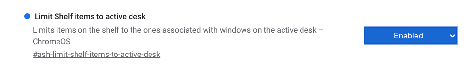Works like it used to. The Email apps on desk 2 are hidden when I'm on desk 1. Combined with the filtered alt-tabbing, it helps out.

## Pixel canvas recording

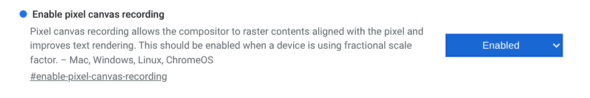I wondered if this would help Linux vscode display its fonts clearer. It didn't.

## Launcher image search

  

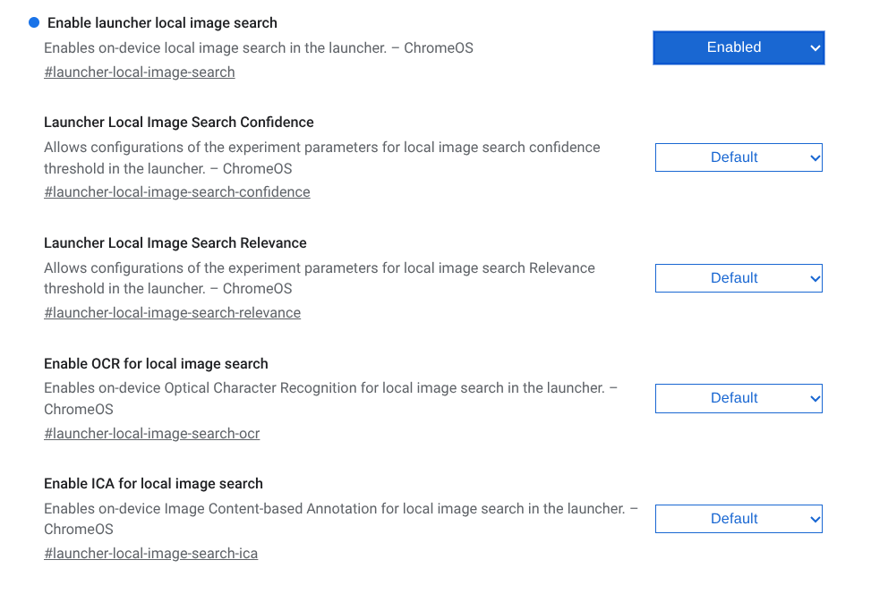Doesn't seem to mean searching text within images, at any rate. I typed a couple terms from the images pasted here, and it didn't show up any of them. I left the others undone, it could've been that.

Later on, it seemed to show images, but only ones that seemed to be showing what the keyword was, not the keyword itself being written in the image:

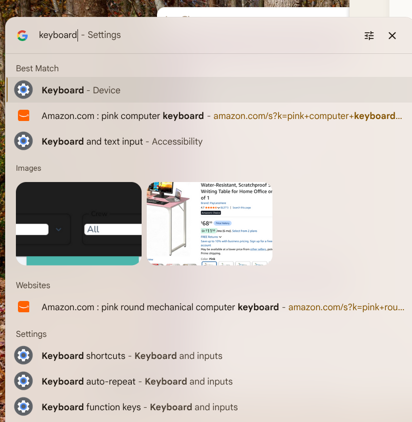  

## Touchpad libinput

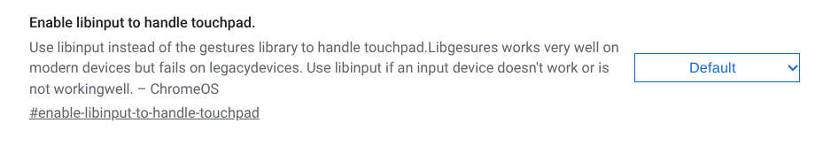This seems like it would be useful if any of those older Chromebooks start having touchpad issues.

## Tab muting

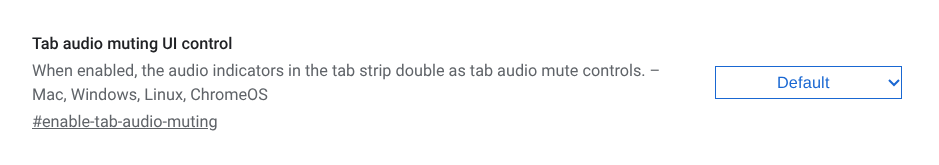I was just trying to click the tab audio button recently, to mute it. I left it disabled for now, though, since it wasn't much bother.  

## App launch keyboard shortcut

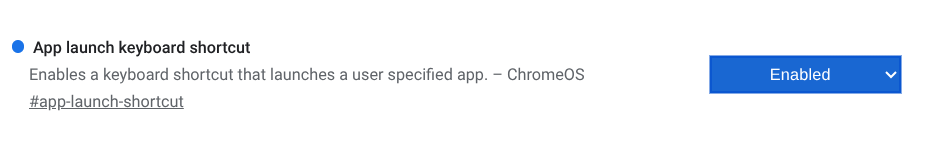I have to look for this one to see if I can find where it is.

Can't seem to find it anywhere in the Keyboard Shortcuts.

## Desktop OS UI

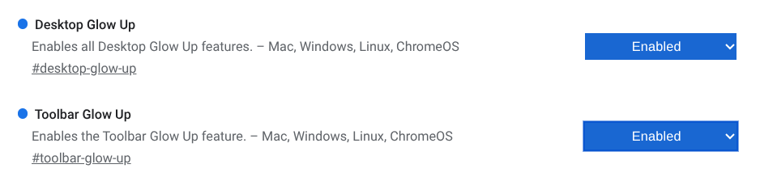These two apparently just make the  buttons bigger.

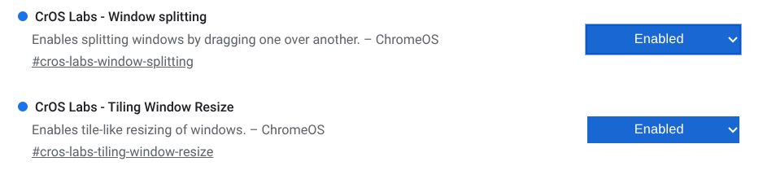I wanted to see if it meant windows could be naturally popped to 1/4-screen, but it doesn't. It doesn't seem to have done anything. The "window splitting" one just seemed interesting, I was trying to imagine dragging a window on top of another window.

## Web app install dialog

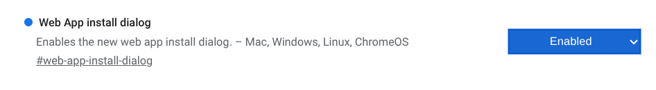

Okay, I mean I suppose that's fine. It _is_​ a new dialog. Not very interesting, though, still no naming capability.

## Reading mode immersive mode​

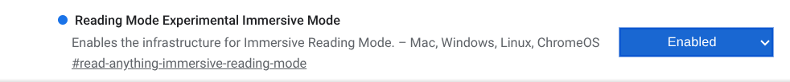This apparently doesn't mean page-flip UX.
