# Typography toggle

`2026-07-20 11:21 PM`​

The idea was on a pocket card too.

Swipe to turn into a table of contents but with an animation showing how it folds into it.

The progress the settle animation starts with seems like it's too far back. But maybe that's not it either. When collapsing, it's moving down from above. When expanding, it's moving up from below.

I wonder if it's the setting it back from being fixed? Maybe it's getting set back to non-fixed but then it's also trying to animate to the non-fixed position, thinking that it's still fixed. Maybe it needs to wait to be set back to non-fixed till after the animation finishes.

## Spike is proven

This UX affordance is definitely worth it. 

I also want to make it swipe from left to right for both maybe.

Also buttons should also help the header in place.

And a complete rewrite might not be so bad.

## Not so bad to figure out the code

It wasn't so bad to start figuring it out, like I thought it would be. Then I finally started to get a better understanding of what copilot was talking about, too.

## Danger of using for editor

`2026-07-21 09:42 AM`​

The text caret moves with drags, here in Fieldnote. That feature might interact with this.

## Super fast try run locally

Try to install it locally to test it

Got Bundler installed but it fails, running from `~/blog`​ so I think it should work? Just no more time tonight to ask Grok or whoever for more.


### Got it

Got it to run! `2026-07-22 10:18 PM`​

I wonder if I can get some console logs in to start seeing what the interaction/animation is doing...

I found if I remove the `keepAnchorLocked`​ functionality, it at least doesn't flash all over the place anymore.

This file should be much easier to read and debug and understand going forward. Use `bundle exec jekyll serve`​ to run.

## Fix clicking not squishing stuff like dragging does

It seems to be because the `--topography-progress`​ CSS variable is not updated when you just click, vs when you drag it is:

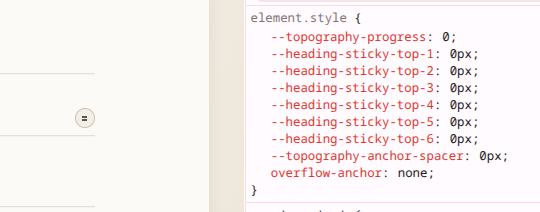It *should*​ be setting it to 1:

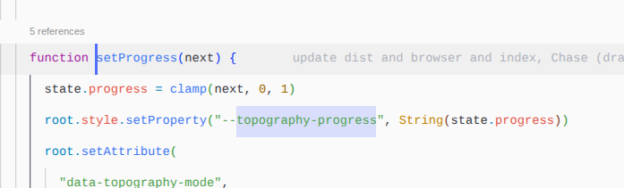We see one `setProgress`​ call and then many `root`​s logged (I added the log right below the line with `root.style.setProperty`​:

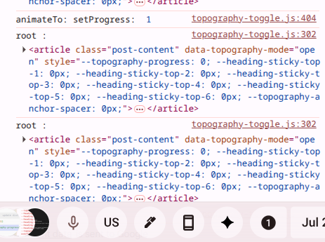

### Window management for this

Kinda doing `alt+tab`​ between 2 VSCode windows, the preview browser, and the notes: 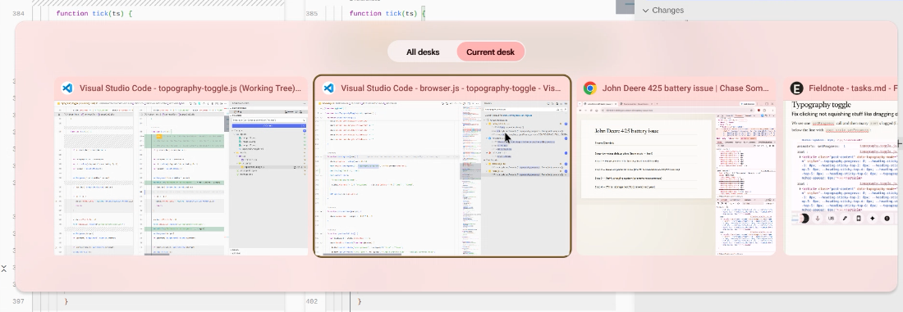

After making an update in the `typography-toggle`​ repo, I have to switch to the `blog`​ repo and uninstall it, install it, run the sync script, then restart the server if the server doesn't auto-rebuild.

Also optionally close and re-open the `ctrl+k Ctrl+v`​ version of the file to see the new changes.

### Confirmed not the wrong `root`​ element

It is setting stuff on it, it's just setting it back to `0`​ right after setting it to `1`​.

Huh, the `target`​ it's setting to is set *outside*​ the `animateTo`​ function.

### A bit of tracing

So, tracing it, it seems to be something from ResizeObserver `measureSegments`​. Which just `setProgress(state.progress)`​es it right after any resizing. So `state.progress`​ is getting set to `0`​ somewhere I guess, only on the click route not the drag route.

This makes it seem like almost like the `measureSegments`​ sets it to `0`​ after the first time or something: 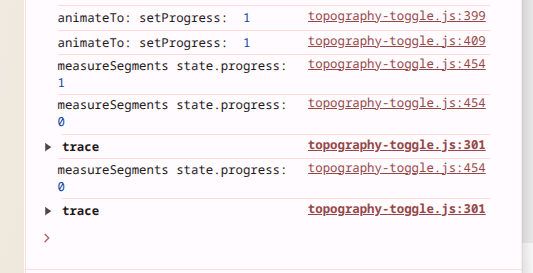

There seems to be a doubling up going on here: `measureSegments`​ runs twice for each setProgress, and has one accurate number and one inaccurate number:

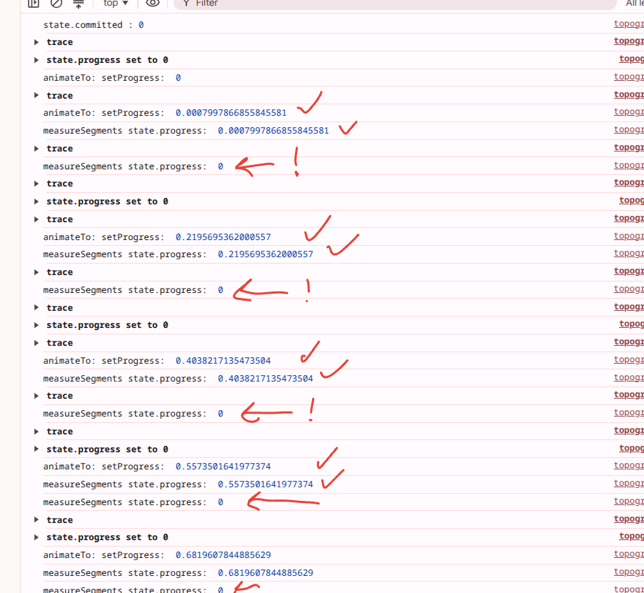`2026-07-25 01:57 PM`​

There're a few callsites that call the `queueMeasure`​ function:

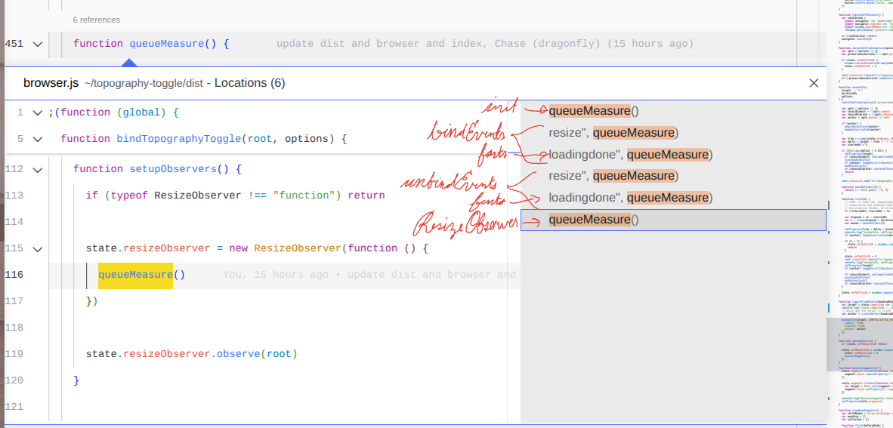Init, bindEvents, unbindEvents (don't really call it, just reference to remove), and a ResizeObserver. Maybe the resize window event and the ResizeObserver are firing together? But still, you'd think that it would dedupe that since it gates it on `state.rafMeasureId`​: 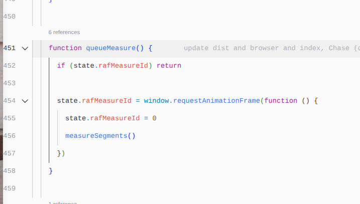

It seems to be that, somehow, the `state.progress`​ is being set back to `0`​ between every `tick`​ of the `animateTo`​ function.

### Ask copilot

Okay, I'm just going to see if Copilot can figure it out from here: 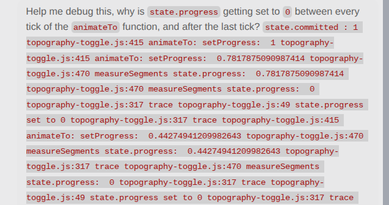

He seems to think it's because `measureSegments`​ makes layout work happen, which triggers the Resize Observer again to set the progress:

> The zero is not coming from a hidden setter. In this codebase, state.progress is only written in setProgress(), and measureSegments() calls setProgress(state.progress) again after measuring. That means the repeated writes are coming from re-entrant measure passes, not from some separate “reset” path. See index.js:295, index.js:420, and index.js:429.
>
> The reason you see it between animation ticks is the observer loop. setProgress() changes a CSS custom property and a data attribute, which can trigger layout work; the ResizeObserver/queueMeasure() path then schedules measureSegments() again. So the animation frame writes a nonzero progress, the measure pass runs, and later the settle path completes with setProgress(target). If target is 0, you will always see the final zero write too. The explicit final write is in animateTo() at index.js:342.
>
> Short version: the extra 0 logs are almost certainly from measureSegments() being re-entered by resize/layout churn, plus the final settle-to-open write. If you want, I can help you break the loop by adding a guard so measureSegments() does not call setProgress() when progress has not actually changed, or by suppressing measure scheduling while animateTo() is actively settling.

### Try guarding measuring when animating

So let me see if I can do what he says and not keep spending money on him. Guard the measure based on animation being running.

I'll try it based on the `is-settling`​ class.

It seems to work well until the end:

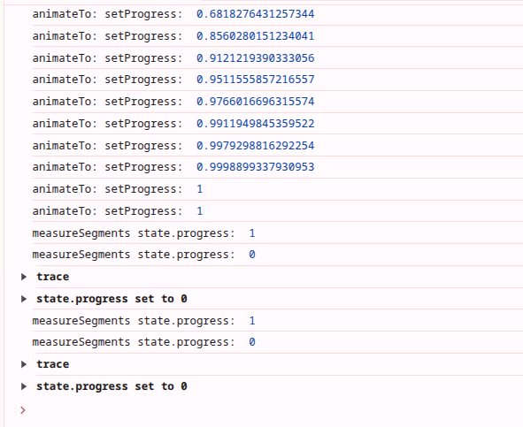The animation also includes the indentation and compression until the end state, as well.

Setting a timeout before removing the class fixes it, at least for the final state after all movement is done:

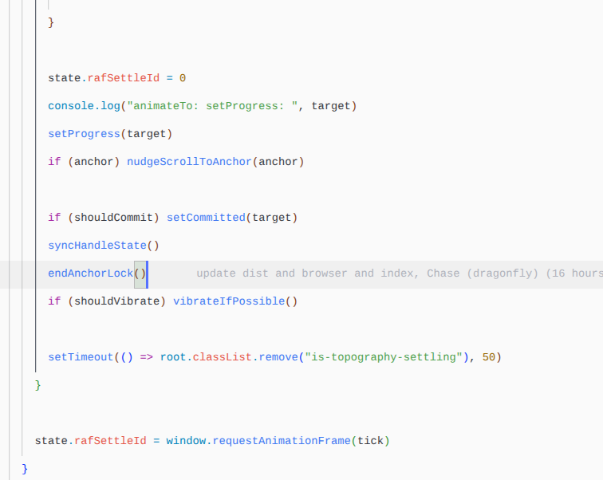

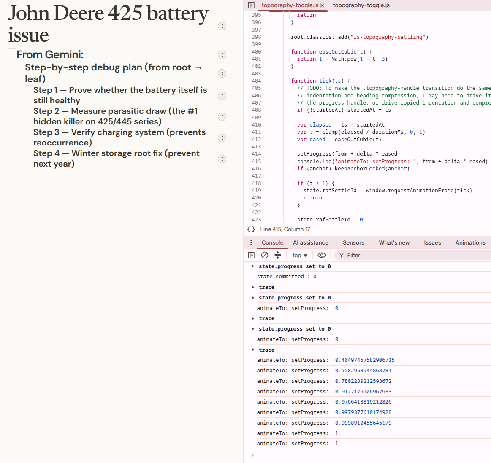

Although it still has flashing as if it was `0`​ for a moment before it settles on `1`​ (`0`​ is expanded, `1`​ is collapsed).

### Fixed

Although I can't remember how, super fast, as of writing I'm just making a quick pass. And the solution was only part solving it.

## Reference: how are you supposed to link packages for local testing?

[Grok says](https://grok.com/c/68f55354-ef80-4055-be49-da52ad021c5b?rid=22fe0520-5922-4f37-9512-633854eb2778) this:

```
# In your package directory
cd ../x
npm link

# In the consuming project
cd your-app
npm link your-package-name   # use the name from package.json, not the folder
```

Then you do this when finished:

```
npm unlink your-package-name   # in the app
cd ../x
npm unlink                     # in the package
```

Maybe I can try that next time.

## Try make spacers stay after until scrolling

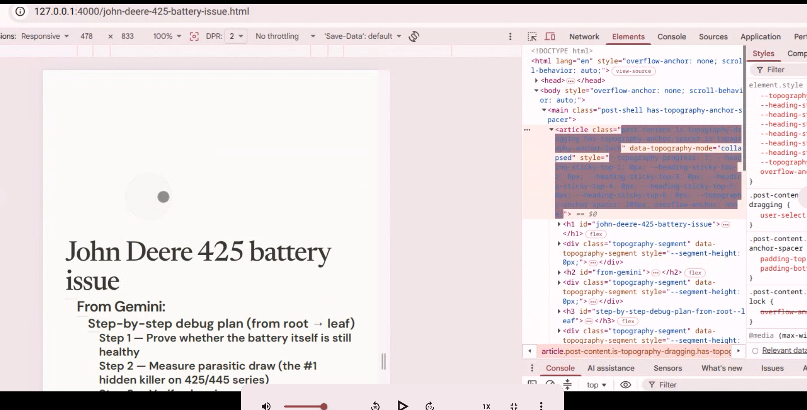I'm dragging the 'From Gemini' or 'Step-by-step' header in this screenshot. I found in the code where we apply spacers, but I couldn't make it pop in the page visually. I tried writing down those classes that pop up but I think I didn't have it all correct.

I noticed that the whole ToC pops downward the moment I start dragging, too (that's what just happened before the screenshot). So, the spacers still have an issue where they're moving the content before the interaction.

The code comment was left in the working tree.
