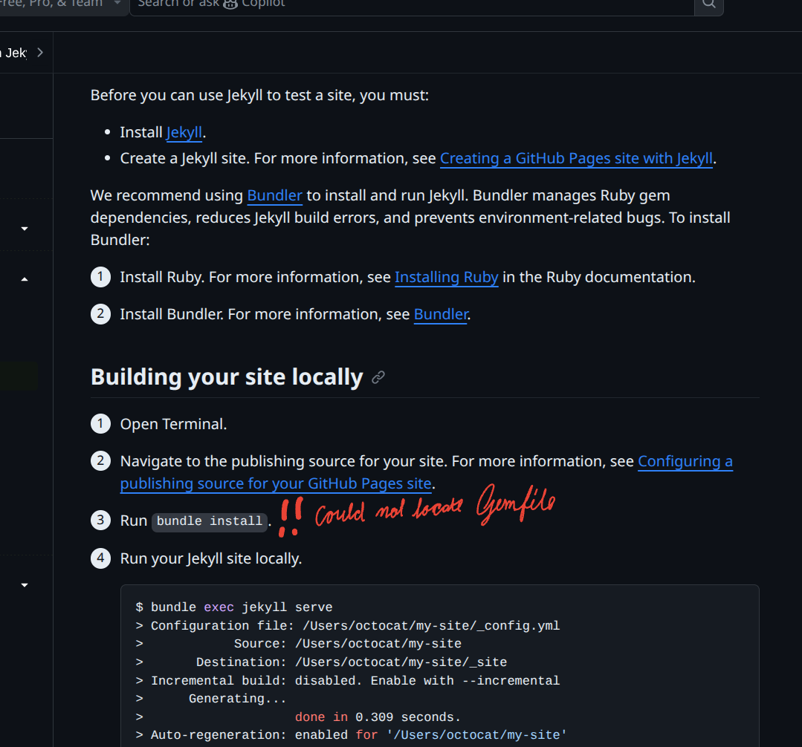
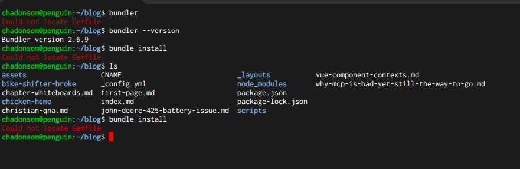
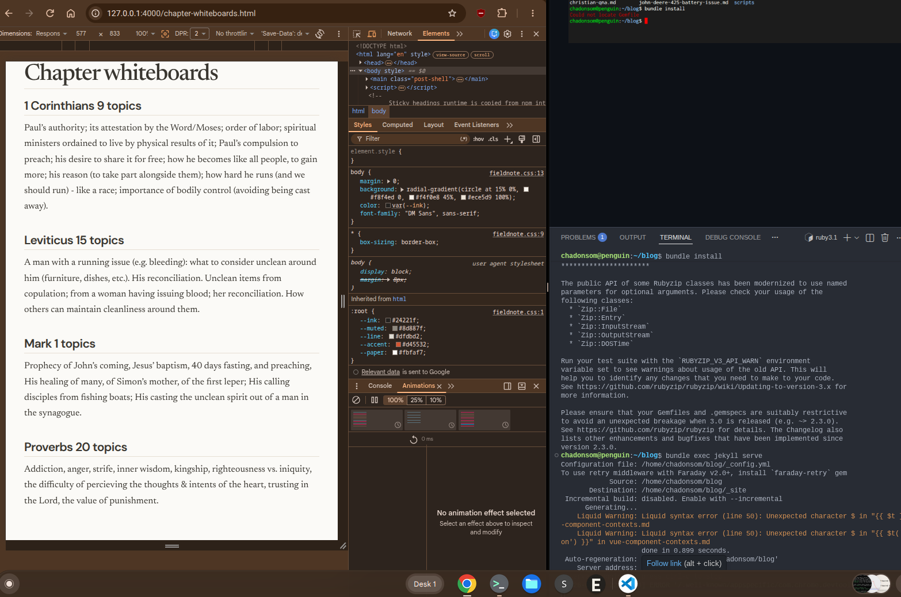

# Typography toggle

`2026-07-20 11:21 PM`​

The idea was on a pocket card too.

Swipe to turn into a table of contents but with an animation showing how it folds into it.

The progress the settle animation starts with seems like it's too far back. But maybe that's not it either. When collapsing, it's moving down from above. When expanding, it's moving up from below.

I wonder if it's the setting it back from being fixed? Maybe it's getting set back to non-fixed but then it's also trying to animate to the non-fixed position, thinking that it's still fixed. Maybe it needs to wait to be set back to non-fixed till after the animation finishes.

## Spike is proven

This UX affordance is definitely worth it. 

I also want to make it swipe from left to right for both maybe.

Also buttons should also help the header in place.

And a complete rewrite might not be so bad.

## Not so bad to figure out the code

It wasn't so bad to start figuring it out, like I thought it would be. Then I finally started to get a better understanding of what copilot was talking about, too.

## Danger of using for editor

`2026-07-21 09:42 AM`​

The text caret moves with drags, here in Fieldnote. That feature might interact with this.

## Super fast try some things

Try to install it locally to test it

Got Bundler installed but it fails, running from `~/blog`​ so I think it should work? Just no more time tonight to ask Grok or whoever for more.

## Got it

Got it to run! `2026-07-22 10:18 PM`​

I wonder if I can get some console logs in to start seeing what the interaction/animation is doing...

I found if I remove the `keepAnchorLocked`​ functionality, it at least doesn't flash all over the place anymore.

This file should be much easier to read and debug and understand going forward. Use `bundle exec jekyll serve`​ to run.
