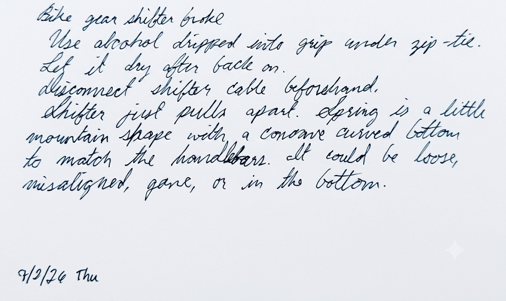
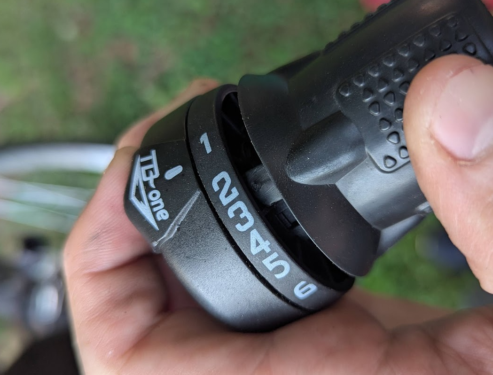
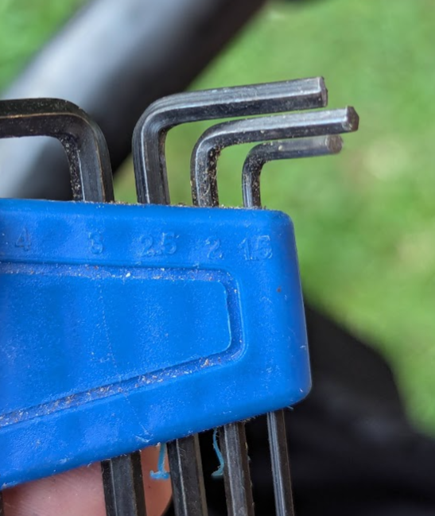
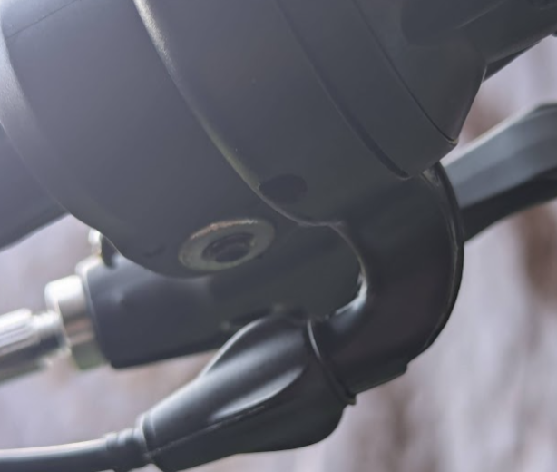
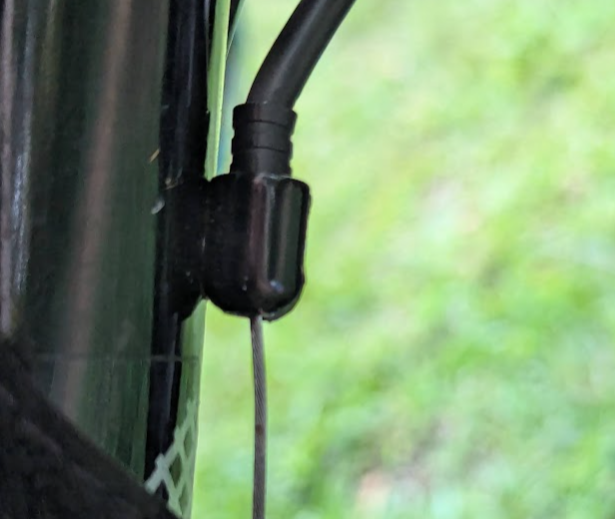
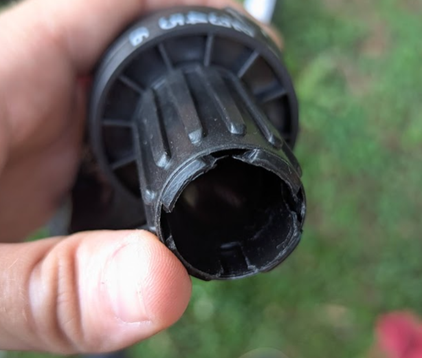
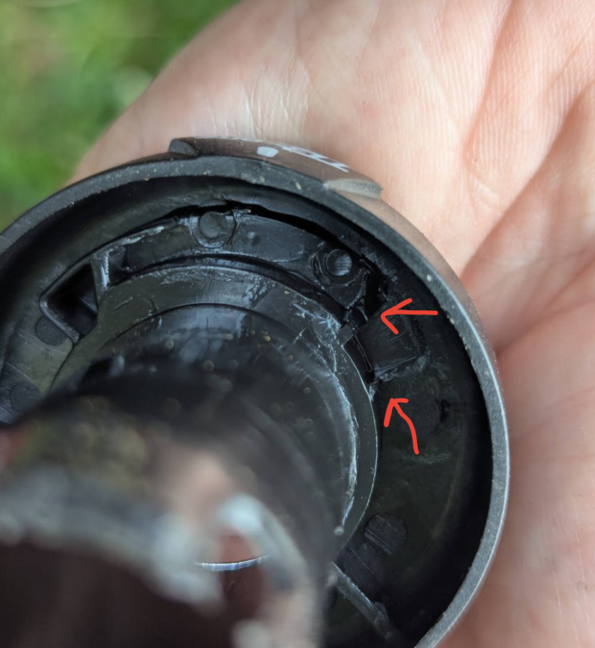

# Bike shifter broke

Created: July 2, 2026 7:06 PM

## Original research notes

You can use water instead of alcohol to get the grip off. I pushed a screwdriver into the grip first, although it did scratch the paint.

After I got the grip off, I found the shifter has its own grip, with a key lobe to slot into the plastic part of the shifter.

Then, to get the shifter off the handlebar, I had to use the 2.5mm hex wrench. At first I tried the standard wrench sizes, but stripped out the set screw. Yet, somehow, the metric one still fit snugly after.

I then had to undo the brake cable hold here. To loosen the cable, I had to press the derailleur rearwards and give a good solid pull on the cable.

But after I got it off, the hardest part was getting the shifter spin part and handlebar part to slide apart. It’s apparently clipped on by these 4 clips on the outside side.

In order to get that out, I fiddled for a bit with it, and ended up taking 4 mini screwdrivers and jamming all 4 in each tab at once. The first time I tried pulling, they all turned sideways. After resetting them and holding them upright while pulling on it, it came loose.

The plastic was broken inside. The spring was still in place, but I dropped it in the grass and lost it before taking a photo.

Here are the places where the plastic was broken:

​
